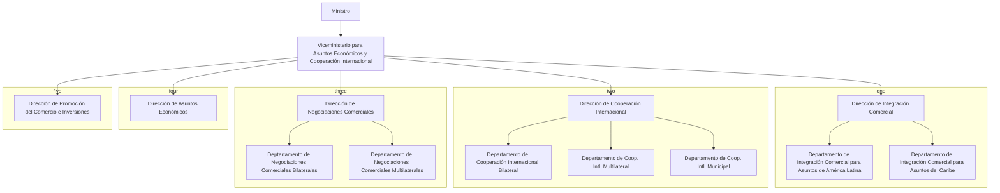

# Organigrama VAECI

```mermaid

flowchart TD

	A[Ministro]
	B[Viceministerio para Asuntos Económicos y Cooperación Internacional]
	
	subgraph one
		
		DIC[Dirección de Integración Comercial]
		DEPT1[Departamento de Integración Comercial para Asuntos de América Latina]
		DEPT2[Departamento de Integración Comercial para Asuntos del Caribe]
		
		end
		
		
	subgraph two
	
		DCI[Dirección de Cooperación Internacional]
		DEPT3[Departamento de Cooperación Internacional Bilateral]
		DEPT4[Departamento de Coop. Intl. Multilateral]
		DEPT5[Departamento de Coop. Intl. Municipal]
		
		end
		
	subgraph three
	
		DNC[Dirección de Negociaciones Comerciales]
		DEPT6[Deptartamento de Negociaciones Comerciales Bilaterales]
		DEPT7[Departamento de Negociaciones Comerciales Multilaterales]
		
		end
		
	subgraph four
	
		DAE[Dirección de Asuntos Económicos]
	
		end
		
	subgraph five
	
		DPCI[Dirección de Promoción del Comercio e Inversiones]
		
		end
		
	A--> B --> DIC & DCI & DNC & DAE & DPCI
	
	DIC --> DEPT1 & DEPT2
	
	DCI --> DEPT3 & DEPT4 & DEPT5
	
	DNC --> DEPT6 & DEPT7

```