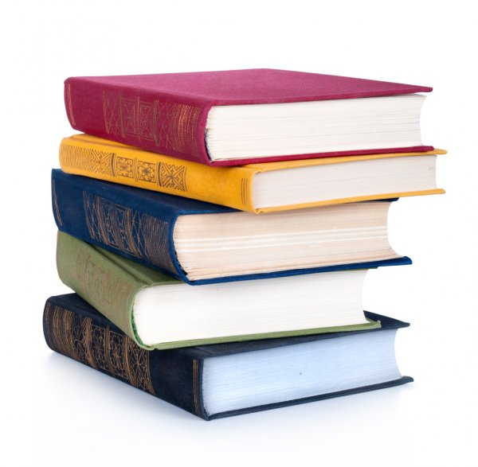

= Book Recommendations / Recomendaciones de libros

Un listado de libros que pretendo leer. La mayoría estarán en inglés.

A list of books I intend on reading.

== Theology

== Biblical studies

* *A Biblical Theology of Exile* by _Daniel L. Smith Christopher_
* *The Art of Biblical Poetry* by _Robert Alter_
* *The Art of Biblical Narrative* by _Robert Alter_

== History / Historia

* *Manual de Historia Dominicana* by _Frank Moya Pons_
* *Soft Power* by _Joseph Nye_

== International relations

== Diplomacy
* *Diplomacia Contemporanea* by _Manuel Morales Lama_

== Fiction

* *A Wrinkle in Time* by _Madeleine L'Engle_
* *Phantastes* by _McDonald_ - An incredibly influential book, on such authors as C.S. Lewis and J.R.R. Tolkien
* *The Chronicles of Narnia* by _C.S. Lewis_ - The whole series, made of 7 books. Beautiful story that depicts the dynamics of Christ and Christianity very strongly.
* The Screwtape Letters* by _C.S. Lewis_
* *The Twenty-one Balloons* by _William Pène du Bois_ - For a long time my favorite book.

== Linguistics

* *Because Internet* by _Gretchen McCulloch_ - An amazing popular linguistics book about internet language by _the_ internet linguist and host of the podcast link:https://lingthusiasm.com/[Lingthusiasm].
