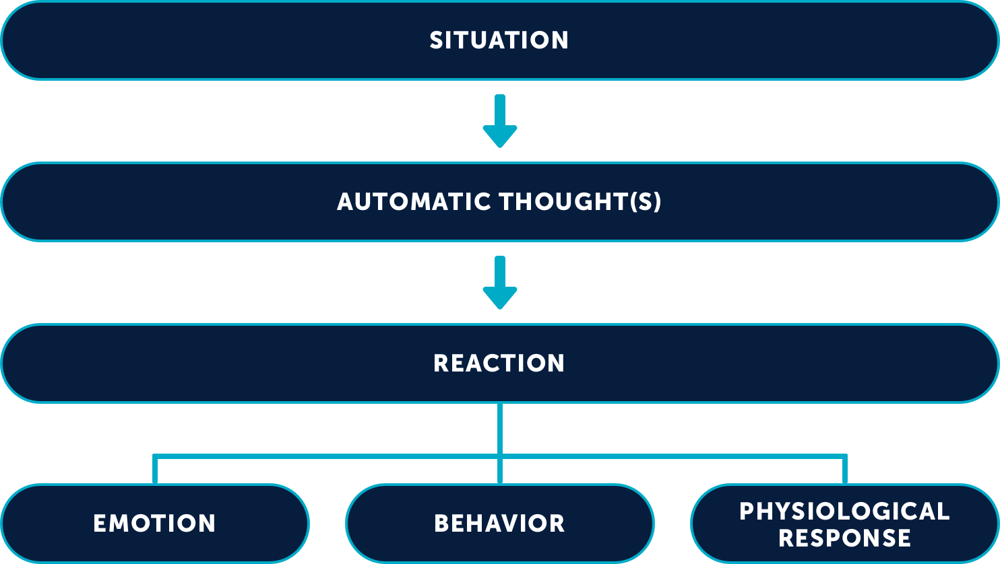

# The CBT cognitive model says thoughts affect behaviors.

The premise of the cognitive model is that an external situation leads to [[Automatic Thoughts]], which cause emotional and behavioral reactions in the person. It means that how a person reacts to a situation is not solely or even mostly dependent on the situation, but on how the person **perceives** the situation.

Those automatic thoughts can be [dysfunctional](<Dysfunctional Thoughts.md>), which causes distress and maladaptive or counterproductive behaviors. 

The cognitive model is used as a framework to understand a person's/patient's distress or problems, through formulations which hypothesize about the causes and maintining influences of their problems.

## References
Beck, Judith S. (2011). *Cognitive Behavioral Therapy: Basics and Beyond* (2nd Ed.). The Guildford Press.

Dobson, K. S., Poole, J. C., & Beck, J. S. (2018). The fundamental cognitive model. In R. L. Leahy (Ed.), _Science and practice in cognitive therapy: Foundations, mechanisms, and applications_ (pp. 29–47). The Guilford Press.

